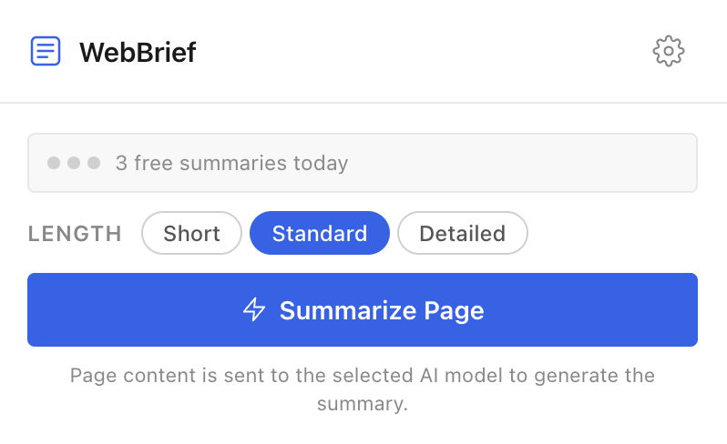
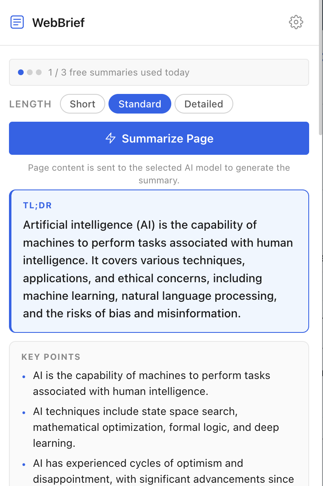
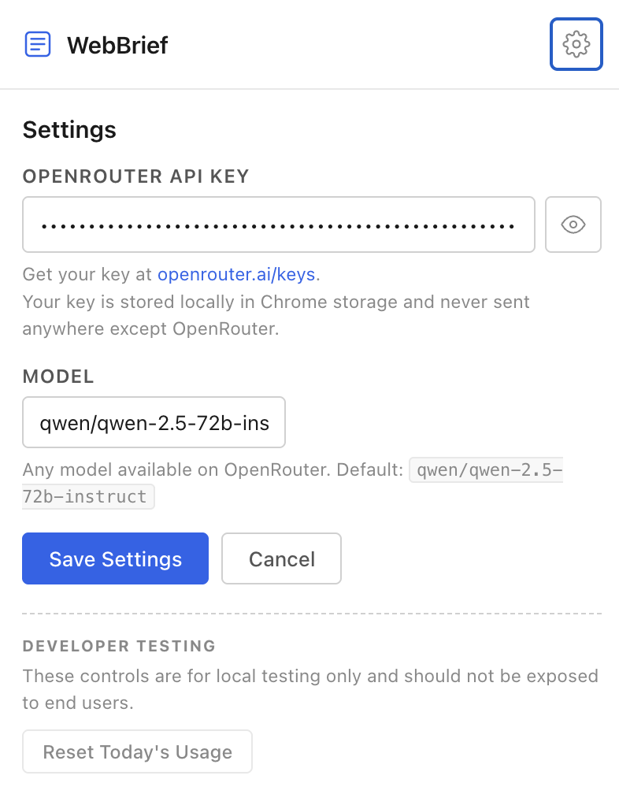

# WebBrief

> **Understand any webpage instantly.** AI-powered structured summaries in your browser.

WebBrief is a Chrome extension that extracts meaningful content from webpages and uses AI via [OpenRouter](https://openrouter.ai) to generate clean, structured summaries — helping you understand articles without reading every word.

## Screenshots

### Extension Popup


### Summary Result


### Settings


## Features

### Core Features
- **Structured summaries** — TL;DR, key points, important details, full summary, and actionable takeaways.
- **Smart content extraction** — prioritizes semantic HTML such as `<article>` and `<main>`, removing navigation, footers, ads, and cookie banners.
- **Long-page support** — splits long webpages into chunks, summarizes them individually, and combines the results.
- **Configurable AI models** — supports models available through OpenRouter.
- **Summary length control** — choose Short, Standard, or Detailed.
- **No backend required** — runs entirely in the browser.
- **Privacy-conscious design** — no accounts, analytics, or permanent storage of page content.

### Freemium Experiment
- **Daily free limit** — three summaries per calendar day, resetting at local midnight.
- **Usage indicator** — displays daily summary usage.
- **Pro concept screen** — introduces a proposed WebBrief Pro plan at $3/month.
- **Early-access flow** — measures interest without processing real payments.
- **Safe usage tracking** — successful summaries count toward the limit; errors and empty pages do not.
- **Developer testing** — reset the daily counter through Settings for local testing.

## Tech Stack

- **Frontend:** HTML, CSS, JavaScript
- **Platform:** Chrome Extension Manifest V3
- **AI integration:** OpenRouter API
- **Storage:** Chrome `storage.local`
- **Architecture:** Client-side, no custom backend

## How It Works

1. Open a webpage in Chrome.
2. WebBrief extracts the meaningful page content.
3. Long content is split into manageable chunks when necessary.
4. The selected AI model generates a structured summary.
5. WebBrief displays the results in the extension popup.

## Installation

WebBrief requires no build step or `npm install`.

### 1. Clone the repository

```bash
git clone https://github.com/LabibCraftsSpells/WebBrief.git
cd WebBrief
```

### 2. Load the extension into Chrome

1. Open `chrome://extensions` in Chrome.
2. Enable **Developer mode**.
3. Click **Load unpacked**.
4. Select the project folder containing `manifest.json`.
5. Pin WebBrief to your toolbar for convenient access.

## Configuration

### Add an OpenRouter API key

1. Open WebBrief from the Chrome toolbar.
2. Open **Settings** using the gear icon.
3. Enter your own API key from [OpenRouter](https://openrouter.ai/keys).
4. Choose a model supported by OpenRouter, if desired.
5. Save your settings.

Your API key is stored in Chrome's local extension storage and used to make requests to OpenRouter. You need your own API key to generate summaries, and API usage may incur charges depending on your provider and model.

### Model Selection

WebBrief is designed to work with models available through OpenRouter. The configured default is `qwen/qwen-2.5-72b-instruct`. Available models and pricing can change, so check [OpenRouter's model directory](https://openrouter.ai/models) before selecting one.

## How to Use

1. Navigate to a webpage you want to understand.
2. Click the WebBrief extension icon.
3. Select Short, Standard, or Detailed summary length.
4. Click **Summarize Page**.
5. Review the generated summary, key points, and takeaways.

## Project Structure

```text
WebBrief/
├── manifest.json
├── README.md
├── .gitignore
├── icons/
│   ├── icon16.png
│   ├── icon48.png
│   └── icon128.png
└── src/
    ├── config/
    │   └── config.js
    ├── content/
    │   └── extractor.js
    ├── services/
    │   └── openrouter.js
    ├── utils/
    │   ├── chunker.js
    │   ├── sanitizer.js
    │   └── usage.js
    └── popup/
        ├── popup.html
        ├── popup.css
        └── popup.js
```

## Permissions

| Permission | Purpose |
|---|---|
| `activeTab` | Access information about the active tab when invoked. |
| `scripting` | Run the content extractor on the active webpage. |
| `storage` | Store the API key and preferences locally. |
| OpenRouter host permission | Send AI requests to the configured OpenRouter endpoint. |

## Privacy

- Page content is sent to OpenRouter and the selected AI model when you request a summary.
- WebBrief displays a disclosure that page content is sent for AI processing.
- The extension does not require an account or use analytics.
- Page content is not intentionally retained as summary history after the popup closes.
- Your API key is stored in Chrome's local extension storage.

Avoid summarizing confidential or sensitive webpages unless you are comfortable sending their content to the selected AI provider.

## Known Limitations

- **Chrome internal pages:** URLs such as `chrome://` cannot be processed.
- **PDFs:** Chrome's internal PDF viewer is not supported by the current DOM extractor.
- **Dynamic websites:** Content loaded after the extraction step may be missed.
- **Single-page applications:** Some complex sites may expose only part of their content.
- **Local files:** Access to `file://` pages must be enabled manually in Chrome's extension settings.
- **Very long pages:** Input is capped at approximately 60,000 characters and five chunks.
- **Response length:** AI output is capped at 2,048 tokens, so some detailed summaries may be shortened.

## Future Improvements

- Context-menu explanations for selected text
- Summary history
- PDF summarization
- YouTube transcript summaries
- Multilingual summaries
- Improved article extraction with Readability.js
- Reading-time estimates
- Local model support through Ollama
- Links from summary points back to source sections

## Development

WebBrief uses plain HTML, CSS, and JavaScript, with no build tools required.

After changing the source code, open `chrome://extensions` and reload the extension.

For debugging:
- **Popup:** right-click the extension and select **Inspect popup**.
- **Content extractor:** open Chrome DevTools on the webpage and inspect the Console.

## License

MIT